# wordpress-app

Create wordpress-server and create 3 volumes of 8 GIB and attach them to server

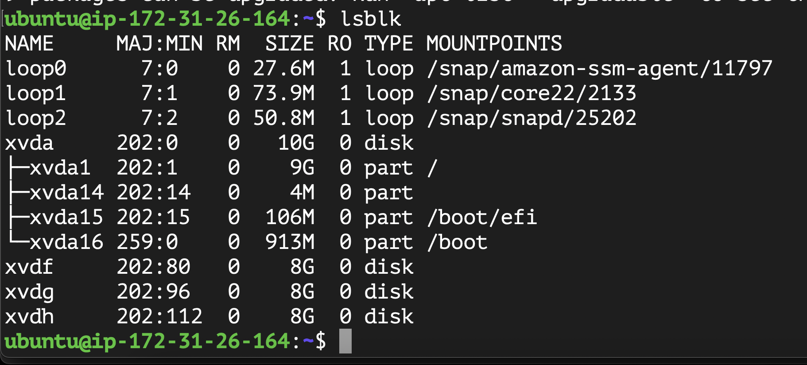

SecurityGroup of webserver
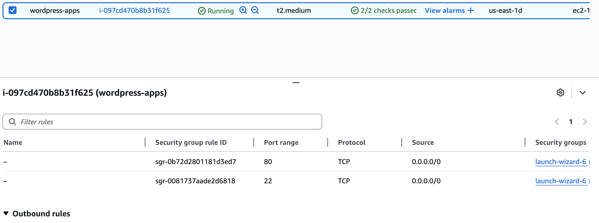

use gdisk utility to create partion on each disk

$ sudo apt update

partition each volume 
sudo gdisk /dev/xvdf
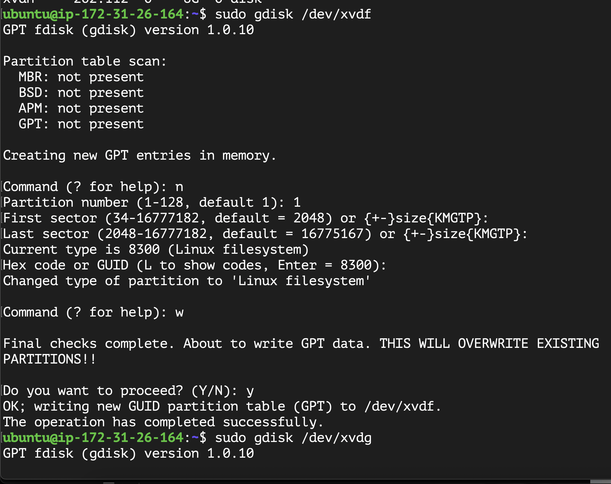

After partitioning
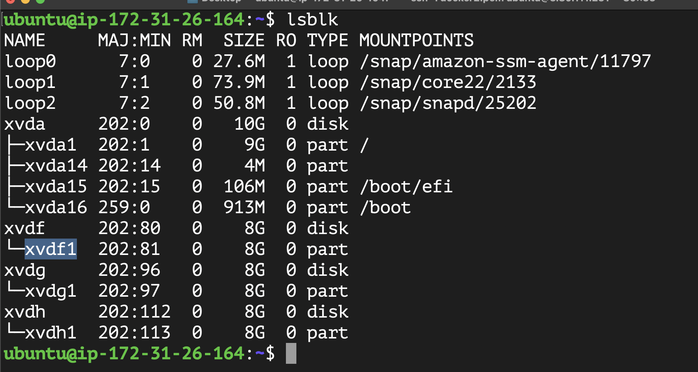

Create physical volumes
$sudo pvcreate /dev/xvdf1
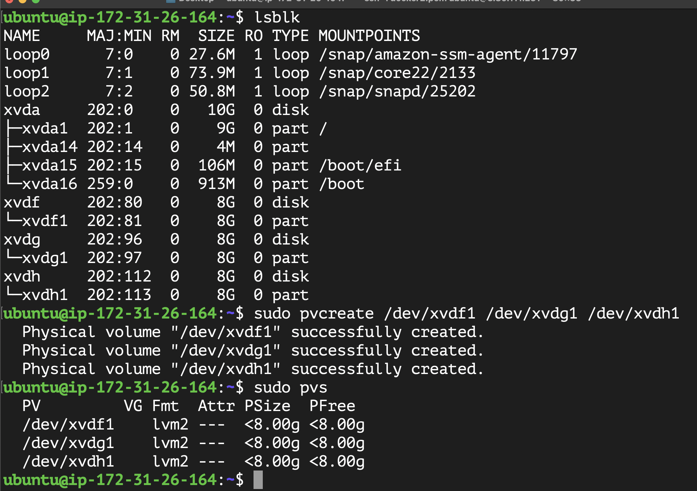

Create volume group
$sudo vgcreate webdata-vg /dev/xvdf1 /dev/xvdg1 /dev/xvdh1
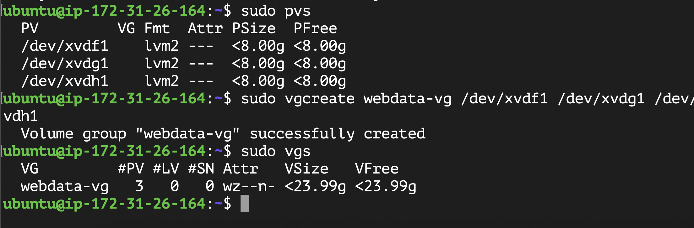

Create logical volume

$ sudo lvcreate -n apps-lv -L 10G webdata-vg
$ sudo lvcreate -n logs-lv -L 10G webdata-vg
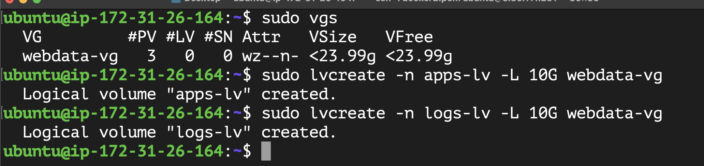

format logical volumes using ext4
$ sudo mkfs -t ext4 /dev/webdata-vg/apps-lv
$sudo mkfs -t ext4 /dev/webdata-vg/logs-lv

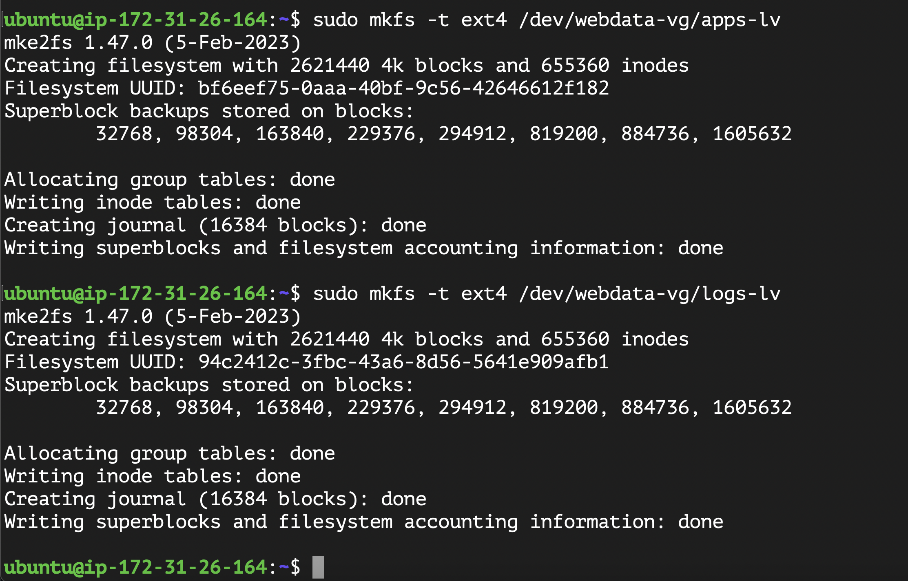

Create mount points
sudo mount /dev/webdata-vg/apps-lv  /var/www/html

Create location to backup logs
sudo mkdir -p /home/recovery/logs

use rsync to backup all files on /var/log/ on /home/recovery/logs

sudo rsync -av /var/log/. /home/recovery/logs/

sudo mount /dev/webdata-vg/logs-lv /home//log

Create persistent mount on /etc/fstab
$ df -h
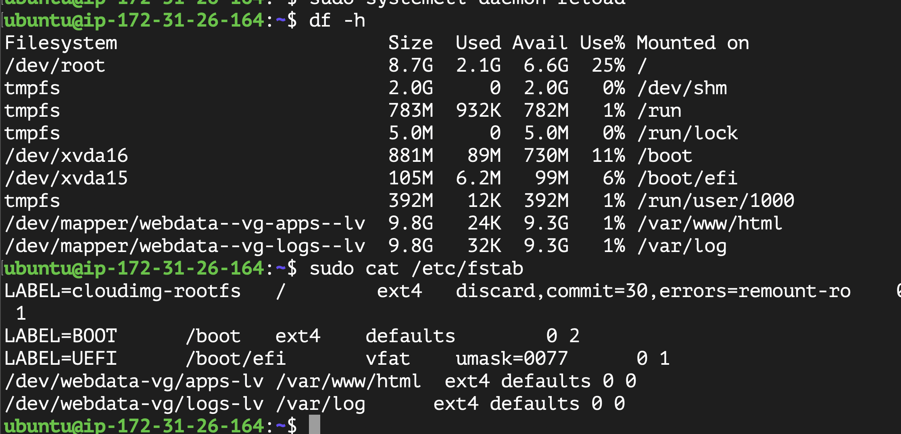

*************** Prepare Database *************
Create other ec2 on private subnet on same vpc
a) Security  Group of wordpress-db server

b) install mysql-server
$ sudo apt install mysql-server
 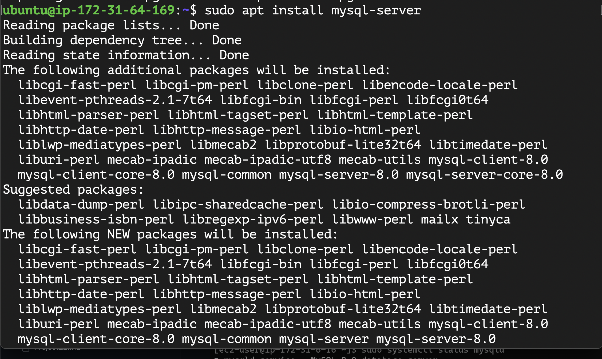

c) Check status of mysql-server 
$ sudo systemctl status mysql
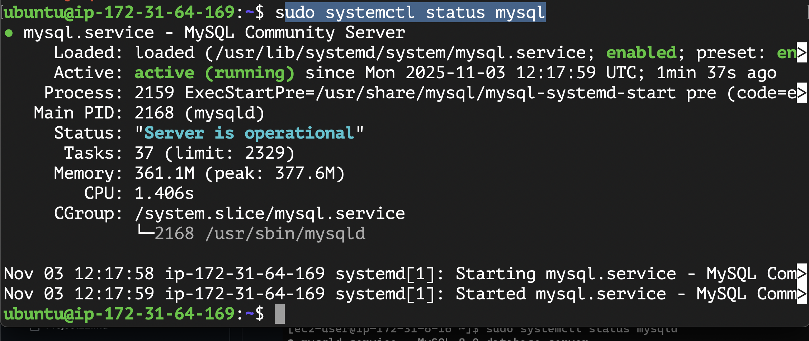

d) connect to db

$ sudo mysql -u root
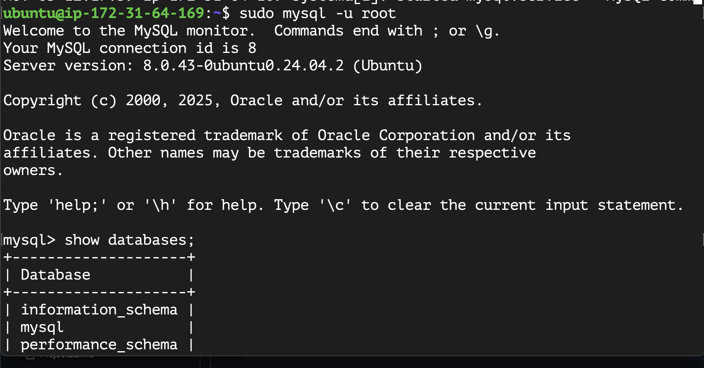

e) Create Database and user 

> Create database wordpress;
> Create user 'esraa'@'wordpress-_server_private_ip' IDENTIFIED By 'psssword';

> Grant all privileges on wordpress.* TO 'esraa'@'wordpress-_server_private_ip' ;

> Flush privileges;

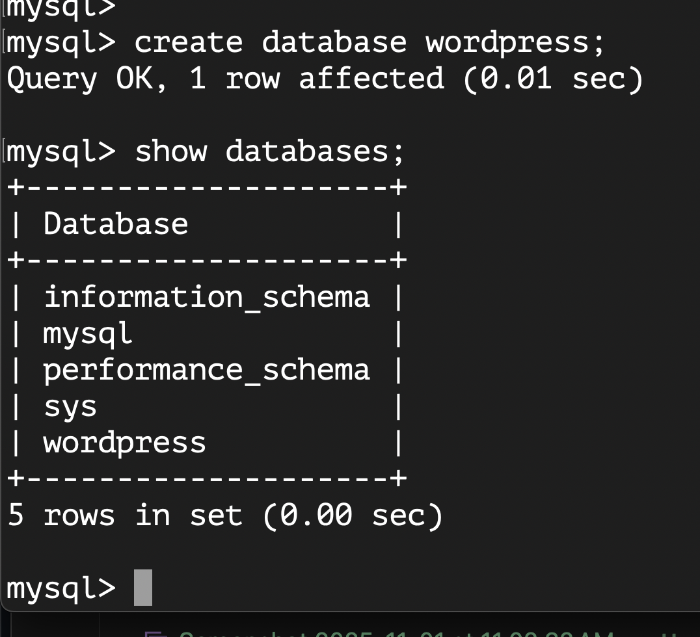

f) modify mysql configuration to accept traffic from any ip not localhost

g) Restart mysql

$ sudo systemctl restart mysql

*********************** Install wordpress on wordpress-server *****

a) Install nginx
$ sudo apt update -y && sudo apt install -y nginx
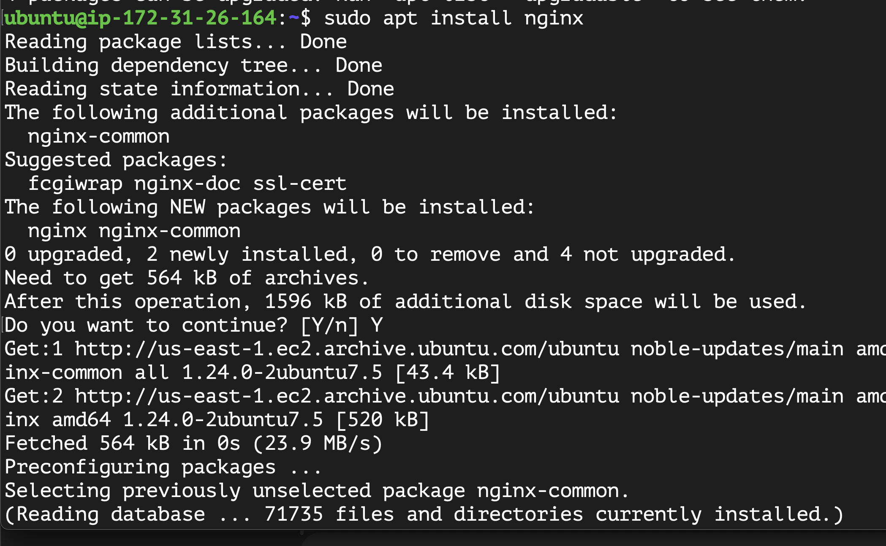

b) Install wordpress
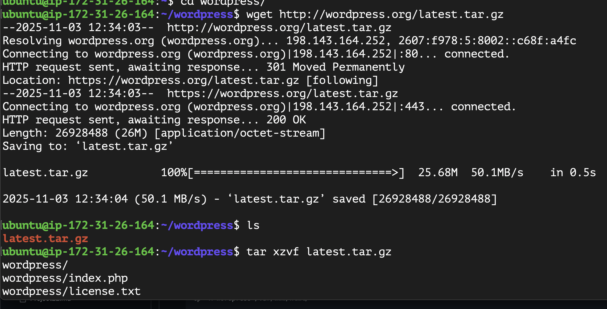

c) install php php-fpm php-mysqlnd php-mysqlnd
sudo apt install php8.3-fpm php 

c) extract files
$ tar xvfz latest.tar.gz

$ sudo mv wordpress/* /var/www/html

d) configure wordpress db info /var/www/html/

$ cd /var/www/html
 
$ sudo mv wp-config-sample.php wp-config.php
edit file and configure DB info userr,dn_name,host,password

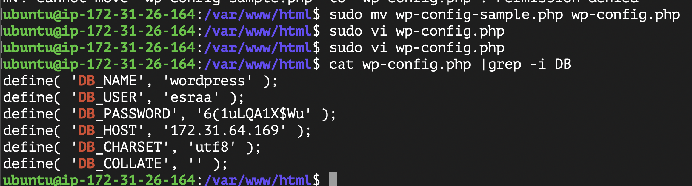
e) install mysql client to this host to test connectivity

$ sudo apt install mysql-client
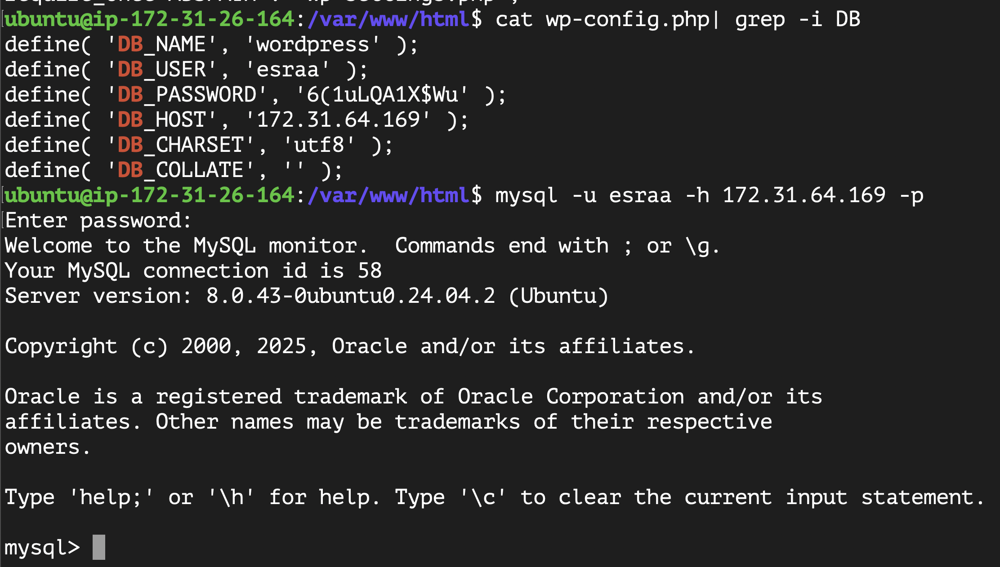

f) change ownership of /var/www/html
$ sudo chown -R www-data:www-data /var/www/*

g) Check nginx configuration

Final result wordpress-admin-portal
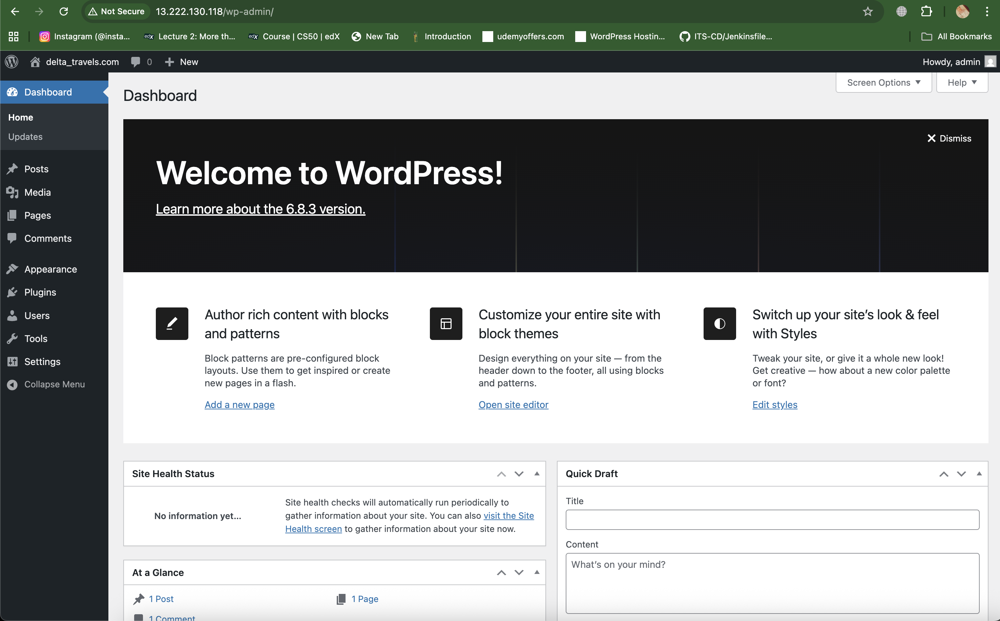

Wordpress-GUI
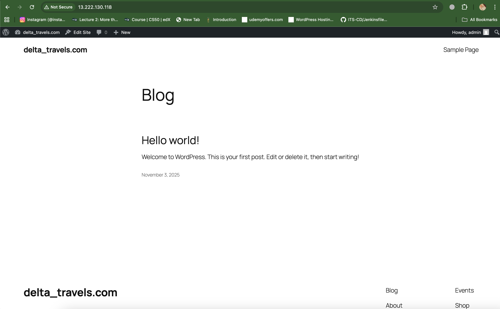

delts_travels.com configured when install wordpress on GUI